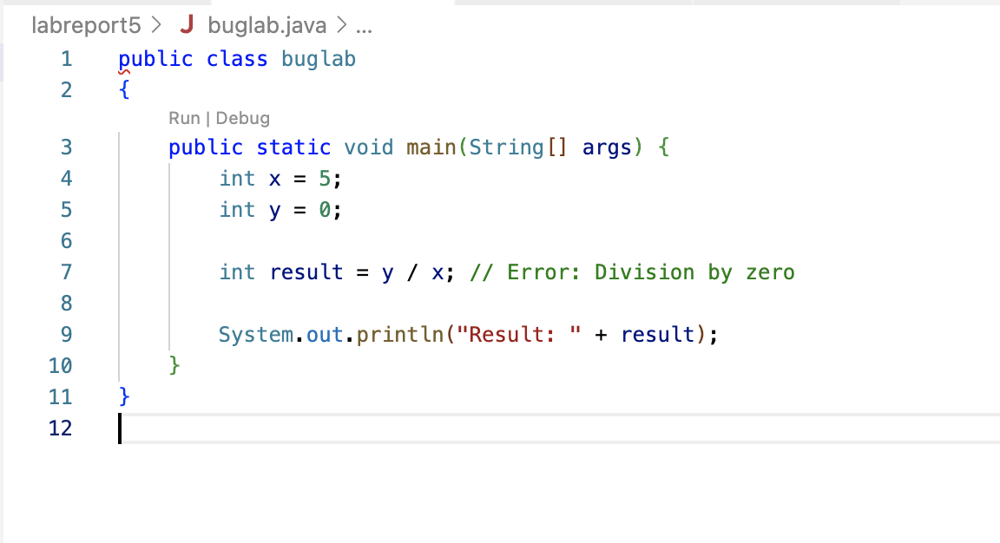
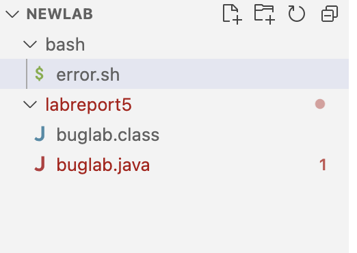

# Lab Report 5
## Part 1: Debugging
**What environment are you using (computer, operating system, web browser, terminal/editor, and so on)?**
* The environment that I am currently using is a Macbook Pro 2020 on Visual Studio Code. I'm trying to run my `buglab.java` file from my terminal, which also includes a bash script called `error.sh`.

**Detail the symptom you're seeing. Be specific; include both what you're seeing and what you expected to see instead. Screenshots are great, copy-pasted terminal output is also great. Avoid saying “it doesn't work”.**
* The symptom I'm seeing right now is that my file is compiling, but when I try to run it, there seems to be an error within my code that isn't outputing the right result.
```
veraniasalcidodale@Favorites-MacBook-Pro labreport5 % java buglab
Exception in thread "main" java.lang.ArithmeticException: / by zero
        at buglab.main(buglab.java:7)
```
* The expected code that I would want is:
```
Result: 0
```

**Detail the failure-inducing input and context. That might mean any or all of the command you're running, a test case, command-line arguments, working directory, even the last few commands you ran. Do your best to provide as much context as you can.**
* The failure-inducing context would be my actual my `buglab.java` file that I'm trying to run from my terminal:
```
public class buglab 
{
    public static void main(String[] args) {
        int x = 5;
        int y = 0;
        
        int result = x / y;
        
        System.out.println("Result: " + result);
    }
}
```
* Along with my buglab.java file, I also have a bash script called `error.sh` that looks like this:
```
#!/bin/bash

# Compile the Java code
javac ErrorExample.java

# Check if the compilation was successful
if [ $? -eq 0 ]; then
    echo "Compilation successful. Running the program..."
    
    # Run the Java program
    java ErrorExample
else
    echo "Compilation failed. Please fix the errors in your code."
fi

```
* The last few commands that I ended up running were:
```
veraniasalcidodale@Favorites-MacBook-Pro labreport5 % javac buglab.java
veraniasalcidodale@Favorites-MacBook-Pro labreport5 % java buglab
Exception in thread "main" java.lang.ArithmeticException: / by zero
        at buglab.main(buglab.java:7)
```
## TA Response:
* hi! This bug sounds a bit tricky, but I think you might want to look within your `buglab.java` file and look closely within     the math that you are doing there. Maybe it could seem that a wrong operation was done.
  Hopefully this might help your error!

## Output showing student taking advice of TA



* It now works entirely!

## What the problem was
* The main problem within the code above was the fact that the division in the file was wrong! Basically, since x was a valid interger and y was equal to zero, dividing by y was going to throw an error regardless because you cannot divide by zero!!!
It's illegal!

## At the end, all the information needed about the set up
* The `buglab.java` file needed to have the bash script `error.sh` along with two java files called `buglab.java` and `buglab.class`.
 
 
 *The contents of the file before fixing the bug:*
 * This is what the `buglab.java` file looked like:
 ```
 public class buglab 
{
    public static void main(String[] args) {
        int x = 5;
        int y = 0;
        
        int result = x / y; 
        
        System.out.println("Result: " + result);
    }
}

 ```
 * This is what error.sh bash script looked like:
 ```
 #!/bin/bash

# Compile the Java code
javac buglab.java

# Check if the compilation was successful
if [ $? -eq 0 ]; then
    echo "Compilation successful. Running the program..."
    
    # Run the Java program
    java buglab
else
    echo "Compilation failed. Please fix the errors in your code."
fi
 ```
 * The command line that triggers the bug first opening the terminal was:
 ```
 java buglab
 ```
 * A description of what to edit to fix the bug
The bug that was found in the initial file was that fact that the y variable was set to 0, and the user was trying to divide x by y, but that would throw an error since we wouldn't be able to divide by 0, its not possible. The couple of ways that could have fixed the error would have been to make both x and y not equal to zero or make x zero and y a non-zero number. By doing these alternative ways, the code would be able to divide just fine and would output in the terminal:
 ```
 Result = 0
 ```

## Part 2: Reflection
*
